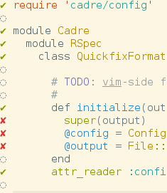

# Cadre

This is a set of tools for aiding development - to integrate testing and
metrics with editors and notifications.

### Coverage in editor


From the command line docs (`cadre how_to`):
```
Try:
cadre vim_plugin > ~/.vim/plugin/cadre.vim
cadre rspec3_config >> spec/spec_helper.rb
cadre simplecov_config >> .simplecov
echo errors.err >> .gitignore
echo .cadre >> .gitignore

Yeah, that's five commands, and you have to do the redirects yourself,
but you can review the output before making it live, and put them
somewhere else if that's what you want.

```

### All your tools working together

The goal of Cadre is to provide bridges between development tools to enhance their utility.

Currently, it includes:

* A libnotify RSpec formatter, so that when a spec run takes a while, you know you'll be notified when it completes
* A vim quickfix formatter, so that you can jump through the backtraces of your rspec fails
* A vim coverage indicator, so that you can see what code has coverage as you edit.

There's also a progress style formatter called "true feelings":

```
> rspec -fUuu spec

.........FuuuuuuuuuuFuuuuuuuuFuuuuuuuuuu
```

### Getting started

Add cadre to your working enviroment.  Either:

    gem install cadre

or add

    gem 'cadre'

to your Gemfile

Run:

    cadre how_to

for the current explanation of how to set the thing up

### Nota Mucho Bene

This thing has atrocious tests. As in: none at all. The way RSpec and Simplecov
set up their plugins, plus the interaction with the filesystem make it
particularly challenging. Normally I wouldn't release software like this, but
I'm finding it useful in daily work. So I guess "battletested"?

### New ideas

The basic requirements to add a feature to Cadre is that:

* useful to developers - this is the fuzziest requirement. All the Cadre tools
  started from the thought "wouldn't it be cool if..."

* at least two existing tools are involved. Ideas to make Vim more useful?
  Great, but unless you're bridging to another application, probably best just
  to write a vim plugin. RSpec configuration? Different gem.

* the tools are both local apps. I'm less wed to this one: it seems obvious
  that there would be value in e.g. github+pivotal mashups. I'm just not sure
  they belong on each dev's machine.

One thing I *definitely* want, though is compatibility with other sets of
tools. Vim and libnotify is what I work with, but it seems to me that Sublime,
growl, OS X notifications, maybe even Emacs should get into the mix. For
certain Minitest deserves to be included.

Those granted, I'd love for Cadre to grow into a freewheeling toolkit of useful
integrations.
